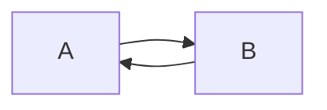
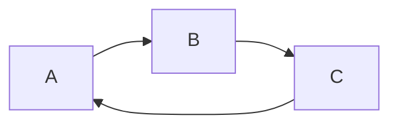
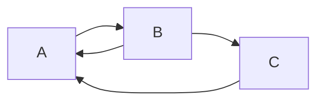

# Model Checking on Hedged Cross-Chain Transactions

This repository provides detailed experiments on validating the properties of our proposed protocols in the paper  "Hedging Against Sore Loser Attacks in Cross-Chain Transactions", In Proceedings of the 40th ACM symposium on Principles of distributed computing, 2021.

We check the properties of our protocols via model checking, using TLA+ language. Since it is inefficient to check our general protocols with $n$ parties, we provide our general model checking recipes and model specifications for three exemplary cross-chain transactions, i.e. two-party swap, three-party swap with one cycle and three-party swap with two cycles. The digraphs are:

Two-party swap:

Three-party swap with one cycle:

Three-party swap with two cycles:

## Recipe for Model Specification

As theat model stated in the paper, we do not consider attackers who compromise the blockchain
itself, through, for example, denial-of-service attacks. Although parties may display Byzantine behavior, smart contacts can enforce ordering, timing, and well-formedness restrictions on transactions, that significantly limit the ways in which Byzantine parties can misbehave.

Thus, the deviating behaviors in our protocols can be reduced to:
1) messing up the orders of steps across different blockchains; 
2) skipping a step, i.e. let a contract/subcontract expire 
