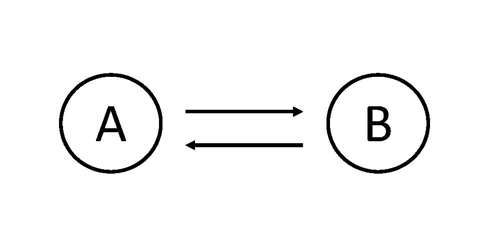
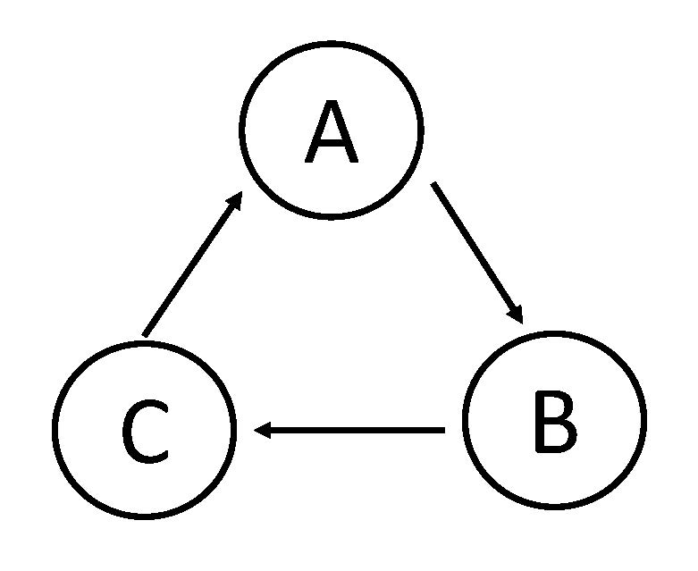
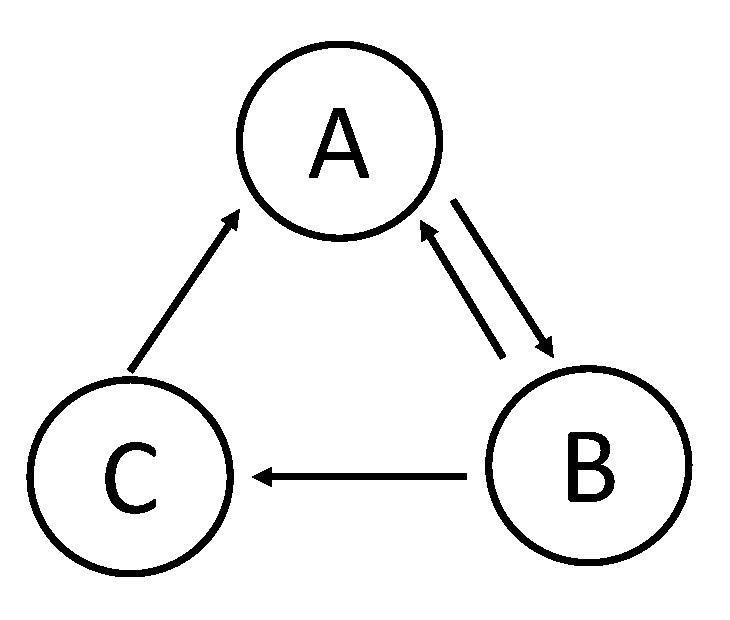

# Model Checking on Hedged Cross-Chain Transactions

This repository provides detailed experiments on validating the properties of our proposed protocols in the paper  "Hedging Against Sore Loser Attacks in Cross-Chain Transactions", to be published in Proceedings of the 40th ACM symposium on Principles of distributed computing, 2021.

We check the properties of our protocols via model checking, using TLA+ language. Since it is inefficient to check our general protocols with $n$ parties, we provide our general model checking recipes and model specifications for three exemplary cross-chain transactions, i.e. two-party swap, three-party swap with one cycle and three-party swap with two cycles. The digraphs are:

Two-party swap: 


Three-party swap with one cycle: 

Three-party swap with two cycles: 



## Recipe for Model Specification

As theat model stated in the paper, we do not consider attackers who compromise the blockchain
itself, through, for example, denial-of-service attacks. Although parties may display Byzantine behavior, smart contacts can enforce ordering, timing, and well-formedness restrictions on transactions, that significantly limit the ways in which Byzantine parties can misbehave.

Thus, the deviating behaviors in our protocols can be reduced to:

1) messing up the orders of steps across different blockchains;  
2) skipping a step, i.e. let a contract/subcontract expire. 

### Smart contract as process

To simulate different behaviors of parties, we treat each proposed asset transfer (an arc) in the graph as an independent process, which corresponds to a smart contract in a blockchain. That is to say, each asset transfer is associated with a process. Participants take steps according to the protocol to change the state of the smart contract. For example, the state of the smart contract can be: assets escrowed/redeemed/refunded, premium deposited/refunded/lost. More detailed can be found in the code.

Since each smart contract is modeled as a process, and participants take steps to modify the state the smart contract, the steps in the protocol can be distributed to ordered steps in each contract. Thus, in each process, we have ordered steps that should take place in that smart contract(or blockchain).

Since the deviating behaviors are reduced to messing up orders of steps across different blockchains or skipping steps, we captured the first kind of behaviors as well as conforming behaviors by the nature of model checker which takes different interleaves of steps in each process. Each step contains an if statement. A party takes this step according to the protocol if the smart contract permits (specified by the if predicate) and otherwise skips the step, for example, if the step is tranversed after timeout. By this design, we also captured the second kind of deviating behaviors.

### Count time

We maintain a seperate process called clock to count global time.


### Structure of each step 

Each step has the following structure:

```
if (previous step on the same process is taken /\ timeout for this step is not exceeded) {
        take the step as protocol defines
        update the resulting contract state
}
else{
        do nothing// meaning skip the step
        update the resulting contract state
        
}
```

## What to check

We need to check whether our safety property, liveness properety and hedged property hold. 

### Safety

For safety property, we only need to guarantee a conforming party does not get a negative payoff. Thus, we need a conforming indicator to track if a party is conforming or not. We need a conforming tracker in each step. For example, for Alice's conformity:

```
if (the previous step in the protocol has not been traversed)/\ the timeout for the previous step is not passed{
    mark Alice as non-conforming;\* meaning alice should wait for the previous step to be traversed or the previous step times out
}

elsif the precondition is satisfied /\ ALICE skips this step
{
    mark Alice as non-conforming;\* normally, it means alice skips this step
}
elsif the precondition is not satisfied /\ ALICE takes this step
{
    mark Alice as non-conforming;
}

}
```

Roughly speaking, precondition means the condition for Alice to take the corresponding step to guarantee she is safe to do so. Usually, precondition is set as the previous step in the protocol is taken. For more concrete preconditions, please seee our code.

#### Check for safety

We have a wallet for each party to denote the amount of assets it has before the protocol starts. Protocol ends when each step in each process has been traversed, no matter the execution of the protocol suceeds or fails.

 For any party, the safety property we check in the model checker is expressed as:

 if (this party is conforming /\ protocol ends)  => this party's wallet's balance >= initial balance

 ### Liveness
 
 For all parties in the swap graph, for example, Alice and Bob, liveness means:

 if (alice is conforming /\ bob is conforming/\protocol ends) => alice's escrow contract is redeemed /\bob's escrow contract is redeemed/\alice's premium is refunded/\bob's premium is refunded

 ### Hedged

 For any party, for example, Alice, if she is conforming and she escrows her asset and it is refunded, then Alice should be compensated with at least 1% of assets.

  if (alice is conforming /\ her asset is refunded/\protocol ends) => alice's wallet's balance>=alice's wallet's initial balance + 1% of asset to swap


For more details, please look at our code in [two_party.tla](./two_party.tla]), [three_party_one_cycle.tla](./three_party_one_cycle.tla]) and [three_party_two_cycles.tla](./three_party_two_cycles.tla).


